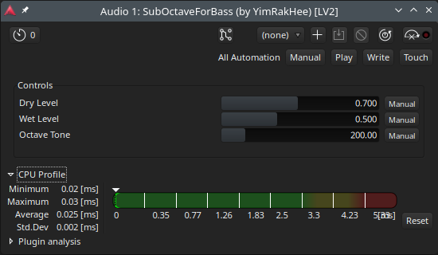

# SubOctaveForBass
Simple but effective Analog-style Sub-Octave LV2 Plugin for Bass Guitar. 
No GUI. 
Tested Environment: Arch Linux / Ardour. 

## Features
- Zero-crossing Flip-Flop logic for stable tracking.
- Built-in Low Pass Filters for smooth sub tones.
- Dry / Wet / Tone controls.

## Requirements
- LV2 SDK
- C++20 compatible compiler (GCC/Clang)
- CMake

## Build & Install
1. `mkdir build && cd build`
2. `cmake ..`
3. `make`
4. Copy `*.so` and `*.ttl` files to `~/.lv2/SubOctaveForBass.lv2/`
